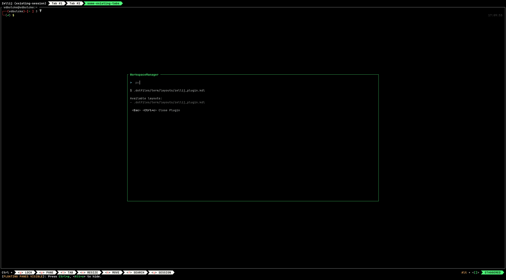
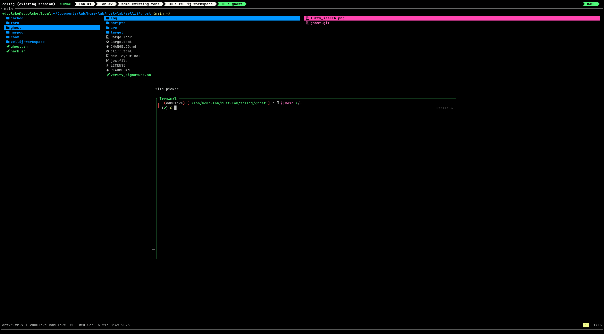

# Zellij Workspace 

A [Zellij](https://zellij.dev) plugin for opening single or multi tabs [layouts](https://zellij.dev/documentation/layouts) within an existing zellij session. 


## Why?

For example if you are using a terminal text editor (helix, neovim, etc), you can use [zellij layouts](https://zellij.dev/documentation/layouts) to open mulitple repo in your editor in separate tabs. 

`zellij-workspace` allows to list all of your layouts in a  `.zellij-workspace` file, fuzzy find layout, and apply the layout to the existing session. 

Select a layout: 



Apply layout to session: 
 



## Requirements

Zellij version `v0.38.0` or later.


| Zellij    | zellij-workspace    |
| --------- | ------------------- |
| `v0.38.x` | `v0.1.0`            |
| `v0.41.1` | `v0.2.0`            |


### Zellij Plugin Permission 

| Permission               | Why                                         |
| -------------------------|---------------------------------------------|
| `ReadApplicationState`   | Subscribe to Pane and tab events            |
| `ChangeApplicationState` | Setting plugin pane name, creating new tabs |

### Host Filesystem Access

[Zellij maps the folder where Zellij was started](https://zellij.dev/documentation/plugin-api-file-system) to `/host` path on the plugin (e.g. your home dir or `default_cwd` in your zellij or the current dir where you started your zellij session).

The plugin will look for a `/host/.zellij-workspace` file (i.e. at the root of the dir of you current zellij session) to load a list of zellij layouts (relative path from your zellij session `cwd`).

Example of a `.ghost` file:
```bash
.config/zellij/layouts/my_custom_layout.kdl
## this is a comment starting with '#'
	# this is also a comment


## empty lines are also ignored
.config/zellij/layouts/another_layout.kdl
```


## Install

### Download WASM Binary


* Download `zellij-workspace.wasm` binary from [release page](https://github.com/vdbulcke/zellij-workspace/releases).
* Verify binary signature with cosign (see instruction bellow)
* copy binary to zellij plugin dir: 
     - `mv target/wasm32-wasip1/release/zellij-workspace.wasm ~/.config/zellij/plugins/`


#### Validate Signature With Cosign

Make sure you have `cosign` installed locally (see [Cosign Install](https://docs.sigstore.dev/cosign/installation/)).

Then you can use the `./verify_signature.sh` in this repo: 

```bash
./verify_signature.sh PATH_TO_DOWNLOADED_ARCHIVE TAG_VERSION
```
for example
```bash
$ ./verify_signature.sh ~/Downloads/zellij-workspace.wasm v0.1.0

Checking Signature for version: v0.1.0
Verified OK

```


### Build from source

> WARNING: requires to have rust installed and wasm `rustup target add wasm32-wasip1`

* `git clone git@github.com:vdbulcke/zellij-workspace.git`
* `cd zellij-workspace`
* `cargo build --release`
* `mv target/wasm32-wasip1/release/zellij-workspace.wasm ~/.config/zellij/plugins/`


## Loading plugin 

### Via Zellij Config

```kdl
shared_except "locked" {
    bind "Ctrl y" {
        LaunchOrFocusPlugin "file:~/.config/zellij/plugins/zellij-workspace.wasm" {
            floating true
            
            replace_current_session true // default false: replace current session with selected layout
            debug false                     // display debug info, config, parse command etc
        }
    }
}
```

### Via CLI

```bash
zellij action launch-or-focus-plugin --floating "file:$HOME/.config/zellij/plugins/zellij-workspace.wasm"
```


